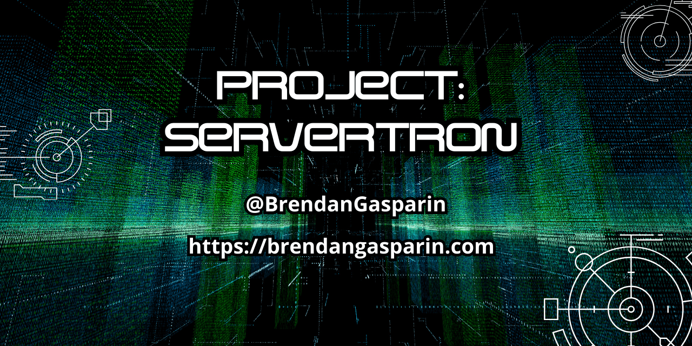
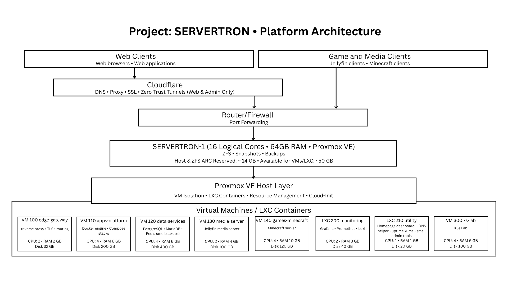
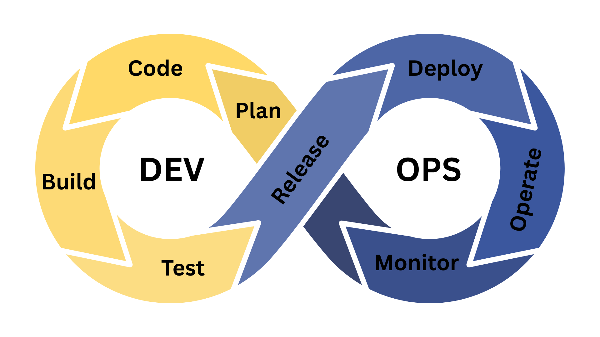

# Project: SERVERTRON

## 1. Overview

Project: SERVERTRON is a single-node Proxmox-based server infrastructure project designed to replicate production-style systems within a home environment.  

*Project: SERVERTRON architecture diagram.*

The project focuses on:
- running real workloads (web, media, and game services)
- applying modern DevOps practices
- documenting the full lifecycle of design, deployment, and operation

## 2. Current Status

**Status:** Phase 1 - PLAN  

Core planning documentation is in progress.  

## 3. Goals

- Demonstrate practical DevOps workflows across a full system lifecycle
- Host real-world workloads (web, media, and game services)
- Built a production-style infrastructure within a single-node constraint
- Maintain comprehensive public documentation of all decisions and implementation

## 4. Scope

The following is **in scope** for the project:

- Functional and responsive web hosting
- Internet-facing game server (initially Minecraft)
- Home media server
- Deliverables for each phase (code-as-infrastructure, documentation)
- Cloudflare configuration

The following are **out of scope** of the first iteration of the project lifecycle:

- Game servers beyond the initial Minecraft server
- Full cloud infrastructure (beyond DNS and edge services)

## 5. Architecture Summary

Project: SERVERTRON is built on a single-node virtualised infrastructure running on a single mini-PC (SERVERTRON-1), using Proxmox VE as the hypervisor.  

The system is structured into two environments:  

- **Production Environment:** Hosts stable, persistent, Internet-facing and complex services requiring strong isolation.  
- **Lab Environment:** Used for development, experimentation, testing, and learning, with a focus on container orchestration and emerging technologies.  

Workloads are distributed according to the following principles:  

- **Virtual Machines (VMs)** are used for Internet-facing services, and complex services requiring strong isolation.  
- **Linux Containers (LXCs)** are used for lightweight internal utilities and supporting services.
- **Containerised Applications** are deployed within dedicated VMs using Docker and Docker Compose.

The architecture includes dedicated roles for networking, application hosting, data services, and observability. Monitoring and logging are implemented to provide observability across system performance and health.  

A Kubernetes environment (K3s) is maintained within the lab environment, separated from the production environment. This is for experimentation and learning purposes.

This architecture is designed to simulate real-world infrastructure within the constraints of a single-node system. It focuses on separation of concerns, scalability of design, and alignment with modern DevOps practices.  

For detailed architecture diagrams and specifications, see [architecture.md](./docs/architecture.md) in the `/docs` directory.  

## 6. DevOps Lifecycle

Project: SERVERTRON follows a structured DevOps lifecycle to guide the design, implementation, and operation of its infrastructure. Each stage represents a distinct phase in the continuous delivery of systems and services.  

The lifecycle consists of the following stages:  

1. [PLAN:](./phases/01-plan/README.md) Define objectives, architecture, and constraints. Establish documentation, system design, and project scope.  
2. **CODE:** Develop configuration files, scripts, and infrastructure definitions. This includes version controlled assets and Infrastructure as Code where applicable.  
3. **BUILD:** Provision infrastructure and construct system components, including virtual machines, containers, and supporting services.  
4. **TEST:** Validate system functionality, networking, and service behaviour within controlled environments prior to release.  
5. **RELEASE:** Approve stable builds and define versioned milestones for deployment.
6. **DEPLOY:** Deploy approved configurations and services into the target environment.
7. **OPERATE:** Run and maintain live systems, ensuring availability, reliability, and performance of deployed services.
8. **MONITOR:** Observe system health and performance using monitoring and logging tools, providing feedback for continuous improvement.

This is an iterative cycle, with the feedback from the monitoring phase informing the planning of the next iteration. This enables continuous refinement of the system while maintaining alignment with DevOps principles and real-world operational practices.  

## 7. Repository Structure

- [/phases/](./phases/01-plan/README.md) - DevOps lifecycle phases and deliverables
- [/docs/](./docs/) - architecture, decisions, and supporting documentation
- [/images/](./images) - diagrams and visual assets
- [roadmap.md](./docs/roadmap.md) - project roadmap
- [goals.md](./phases/01-plan/goals.md) - project goals
- [constraints.md](./phases/01-plan/constraints.md) - project constraints and assumptions
- [decisions.md](./docs/decisions.md) - decision log
- [architecture.md](./docs/architecture.md) - architecture document

## 8. Technology Stack

- **Infrastructure:** Single-node mini-PIC (Intel NUC 13 Pro).
- **Virtualisation:** Proxmox VE
- **Operating systems:** Ubuntu Server (all VMs)
- **Containerisation:** Docker and Docker Compose
- **Orchestration (lab):** K3s
- **Reverse Proxy:** NGINX
- **DNS and Edge:** Cloudflare
- **Data Services:** PostgreSQL, MariaDB, Redis
- **Monitoring:** Prometheus, Loki, and Grafana
- **Version Control & DevOps:** GitHub

## 9. Environments

The scope of the project involves two environments: a production environment and a lab environment.  

- The **production environment** is for hosting services such as web, media, and game servers.  
- The **lab environment** is used for learning, development, and experimentation.

## 10. Getting Started

This repository documents the design, implementation, and operation of the SERVERTRON infrastructure.  

1. To get started, review the [Architecture Documentation](./docs/architecture.md) to understand the system design.  
2. Read the [Goals](./phases/01-plan/goals.md) and [Constraints and Assumptions](./phases/01-plan/constraints.md) to understand the project scope.  
3. Follow the DevOps lifecycle starting with [Phase 1: PLAN](./phases/01-plan/README.md).
4. Explore configuration files and implementation details as they are added in subsequent phases.

This project is being built incrementally. Not all components are fully implemented yet.  

## 11. Roadmap

The development of SERVERTRON follows a structured DevOps lifecycle represented by eight consecutive steps repeating in an iterative loop.

1. PLAN: Define architecture, goals, and constraints.
2. CODE: Create configuration files and infrastructure definitions.
3. BUILD: Provision infrastructure and services.
4. TEST: Validate system functionality.
5. RELEASE: Define stable configurations.
6. DEPLOY: Expose services externally.
7. OPERATE: Run and maintain services.
8. MONITOR: Observe system performance as feedback for improvement in the next iteration of the lifecycle.

For a detailed breakdown of tasks and milestones, see [roadmap.md](./docs/roadmap.md).

## 12. Documentation

Project documentation is organised as follows:  

- [/docs/architecture.md](./docs/architecture.md) — System design and diagrams  
- [/docs/decisions.md](./docs/decisions.md) — Architecture decisions and rationale  
- [/phases/](/phases/) — DevOps lifecycle phases and deliverables  
- [goals.md](./phases/01-plan/goals.md) — Project goals  
- [constraints.md](./phases/01-plan/constraints.md) — Project constraints and assumptions  
- [roadmap.md](./docs/roadmap.md) — Development roadmap  

Additional documentation will be added as the project evolves.  

## 13. Contributing

This is a personal project and is not currently open for external contributions.  

However, feedback, suggestions, and discussion are welcome via issues or comments on associated content (e.g. GitHub or YouTube).  

Future collaboration may be considered as the project evolves.  

## 14. License
[MIT License](./LICENSE).  