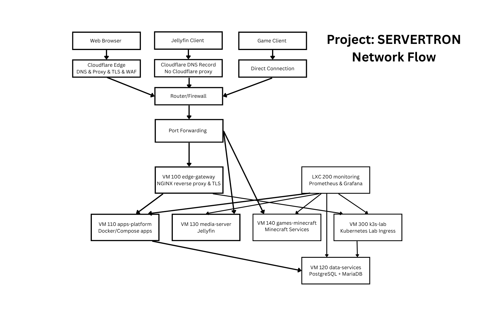

# Project: SERVERTRON Architecture

## 1. Purpose

This document defines the architecture of Project: SERVERTRON, providing the structure, components, and design principles of the system, as well as the relationships between environments, services, and supporting infrastructure.  

*Project: SERVERTRON architectural diagram.*  

It serves as a reference for how the system is designed and intended to operate, and provides a framework to ensure that future decisions remain aligned with project goals and constraints.  

## 2. Design Goals

The architecture of Project: SERVERTRON is guided by a set of design goals that reflect its purpose as a DevOps-focused homelab running real services, as well as a learning platform for new technologies.  

### 2.1. Real-World Alignment

The system is designed to reflect real-world infrastructure patterns, including workload isolation, service separation, and environment-based deployment models. The goal is to simulate production-like systems within a single-node mini-PC.  

### 2.2. Environment Separation

The system is designed with a separation between production and laboratory environments. Production hosts stable, continuously-running services. The lab environment is for development, testing, and experimentation. This separation reduces risk and ensures that experimental changes do not impact operational workloads.  

### 2.3. Appropriate Workload Isolation

Workloads are deployed using a combination of virtual machines and Linux containers based on their requirements. Virtual machines are used for externally exposed or complex services. Containers are used for lightweight internal services. This balances isolation, performance, and flexibility.  

### 2.4. Modularity and Scalability of Design

Although the system operates on a single physical host, the architecture is designed to be modular and scalable. Components are structured in a way that allows expansion to multi-node and distributed systems at a later date without requiring a total redesign.  

### 2.5. Support for Practical Workloads

The platform is intended to run real services, including web hosting, application hosting, media services, and game servers. The architecture prioritises usability and stability for these workloads and the lab environment, while allowing for future expansion.  

### 2.6. Observability and Operational Awareness

The system is designed to support monitoring and observability through standard tools. Visibility into system performance and health is a core requirement of the project for self-education purposes and increased operational awareness.  

### 2.7. Controlled Complexity

The architecture balances realism with practicality. It aims to reflect modern DevOps practices but avoids unnecessary complexity that would hamper progress. Design decisions prioritise clarity, maintainability, and incremental growth.  

### 2.8. Single-Node Constraint

All design decisions are made within the constraint of a single-node system. The architecture must maximise the capability of the available hardware while maintaining separation between services and environments.  

## 3. Architectural Principles

The architecture of Project: SERVERTRON is governed by a set of principles guiding system design, implementation, and evolution.  

The principles are intended to guide all architectural decisions and ensure consistency as the system evolves over time.  

### 3.1 Separation of Environments

Production and lab environments are strictly isolated. Changes are validated in the lab environment before being introduced to the production environment. Experimental changes must not impact production workloads.  

### 3.2 Workload-Appropriate Isolation

Workloads are deployed using virtual machines or Linux containers based on their requirements. Virtual machines are used for externally exposed or complex services, while containers are used for lightweight internal services.  

### 3.3 Single Responsibility per Component

Each system component is designed to perform a single primary function. This reduces complexity, improves maintainability, and simplifies troubleshooting.  

### 3.4 Infrastructure Reflects Real-World Patterns

The system is designed to reflect real-world infrastructure patterns, including service separation, layered architecture, and network segmentation (despite being a single-node deployment).  

### 3.5 Modularity and Loose Coupling

System components are designed to be modular. This allows individual services to be modified, replaced, or extended without requiring changes to unrelated components.  

### 3.6 Lab as a Controlled Experimentation Environment

The lab environment is treated as a safe space for experimentation, failure, and learning. It is intentionally isolated from production workloads.  

### 3.7 Production Stability

The production environment prioritises uptime, stability, and reliability. Changes are introduced in a controlled manner and only after validation in the lab environment.  

### 3.8 Observability

The system is designed to support monitoring and visibility into system behaviour, enabling informed decision-making and troubleshooting.  

### 3.9 Documentation-Driven Development

Architecture, decisions, and system behaviour are documented and version controlled as part of the development process and maintained alongside the system.  

### 3.10 Simplicity and Maintainability

Design decisions prioritise clarity and maintainability over unnecessary complexity, especially within the constraints of a single-node system.  

### 3.11 Conceptual Scalability

The architecture is designed to scale beyond a single node, allowing future expansion without fundamental redesign. Patterns that may impede future growth are avoided.  

### 3.12 Explicit Decision Tracking

All significant architectural decisions are recorded and justified, ensuring traceability and consistency across the system.  

## 4. System Context

## 5. Architecture Overview

### 5.1. High-Level Architecture

Project: SERVERTRON is a single-node, virtualised infrastructure built on Proxmox VE. The system is designed to simulate a production-style environment within the constraints of a homelab.  

The architecture follows a layered model:

- **Edge Layer:** External DNS and security (Cloudflare)
- **Gateway Layer:** Reverse proxy and traffic routing (NGINX on VM 100 edge-gateway)
- **Application Layer:** Cointainerised services (VM 110 apps-platform)
- **Data Layer:** Databases and persistent storage (VM 120 data-services)
- **Service Layer:** Media and game services (VM 130 media-server and VM 140 games-minecraft)
- **Observability Layer:** Monitoring and logging (LXC 200)
- **Lab Environment:** Isolated Kubernetes environment (VM 300)

Each layer is logically separated to improve maintainability, security, and clarity of system behaviour.  

### 5.2. Traffic Flow

External traffic enters the system through Cloudflare, which provides DNS resolution, TLS termination for proxied services, and security features such as WAF and DDoS protection.  

Traffic is handled in two distinct paths:  

#### Proxied Web Traffic

1. Client → Cloudflare (proxied)
2. Cloudflare → NGINX (VM 100 edge-gateway)
3. NGINX routes requests to:
    - application services (VM 110 apps-platform)
    - lab services (VM 300 k3s-lab, if exposed)
4. Services interact with the data layer (VM 120 data-services) as required

#### Direct Service Access

Certain services bypass Cloudflare proxying due to bandwidth or protocol constraints, and Cloudflare's terms and conditions. These include:  

- Jellyfin (media server)
- Minecraft (game server)

These services are accessed via direct connections:

1. Client → Public IP (via DNS-only record in Cloudflare)
2. Router → Port forwarding
3. Target VM (VM 130 media-server for Jellyfin, VM 140 games-minecraft for Minecraft)

### 5.3. Environment Separation

The system is divided into two primary environments:  

- Production Environment: Hosts stable, persistent services (web, media, game, and data services)
- Lab Environment: Hosts experimental workloads, including Kubernetes (K3s)

The lab environment is isolated to prevent experimental changes from impacting production services.  

### 5.4. Architecture Characteristics

The architecture is defined by the following characteristics:  

- **Single-node deployment:** All services run on the mini-PC SERVERTRON-1
- **Layered design:** Clear separation between edge, gateway, application, and data layers
- **Workload isolation:** Services are separated using virtual machines and containers
- **Hybrid exposure model:** Combination of proxied (web) and direct (media/game) access
- **Incremental scalability:** Designed to support future expansion without redesign

### 5.5. Diagram References

The architecture is illustrated in the diagram below:

*Project: SERVERTRON architectural diagram.*  

The network flow is shown in the diagram below:

These diagrams show:  

- system architecture details
- traffic flow through the system
- relationships between virtual machines
- separation between production and lab environments

## 6. Environment Model
### 6.1. Production Environment
### 6.2. Lab Environment

## 7. Host Platform
### 7.1. Hardware Overview
### 7.2. Proxmox Host Configuration
### 7.3. Resource Allocation Strategy

## 8. Compute and Workload Model
### 8.1. Virtual Machines
### 8.2. Linux Containers (LXC)
### 8.3. Containerised Workloads (Docker)

## 9. Network Architecture

## 9. Network Architecture

### 9.1. Network Objectives

The network architecture of Project: SERVERTRON is designed to:  

- Provide secure external access to required services
- Minimise the attack surface of the system
- Separate externally exposed and internal services
- Support both HTTP-based and non-HTTP workloads
- Reflect real-world network infrastructure patterns

### 9.2. External Edge and DNS

External DNS and edge services are provided by Cloudlfare.  

Cloudflare is responsible for:  

- DNS resolution for all public services
- TLS termination for proxied web applications
- Web Applicaiton Firewall (WAF) and DDoS protection for HTTP/HTTPS traffic

Services are divided into two categories:

- **Proxied services:** Web applications routed through Cloudflare
- **DNS-only services:** High-bandwidth or non-HTTP services that connect directly to the client

This separation ensures compatibility with Cloudflare limitations while maintaining security for web-facing services.  

### 9.3. Edge Gateway (NGINX)

The edge gateway is implemented using NGINX on VM 100 edge-gateway.  

Its responsibilities include:  

- Acting as the primary entry point for HTTP/HTTPS traffic
- Routing incoming requests to internal services
- Providing TLS termination at the origin where required
- Isolating backend services from direct Internet exposure

All proxied web traffic is routed through the edge gateway before reaching application or lab services.  

### 9.4. External Access Model

External access to the system follows a hybrid model:  

#### Proxied Web Access

Web services are exposed via HTTPS through Cloudflare and routed to the NGINX edge gateway.  

This provides:  

- TLS encryption
- WAF protection
- IP masking
- Centralised routing

#### Direct Access Services

Certain services bypass Cloudflare proxying and connect directly to the origin:  

- Media services (Jellyfin)
- Game services (Minecraft)

These services are exposed via port forwarding and secured independently.  

This is approach is required due to:  

- Cloudflare policies
- high bandwidth usage (media streaming)
- non-HTTP protocols (game servers)

### 9.5. Internal Networking

Internal communication between services occurs within the Proxmox virtual network.  

Key characteristics:  

- Virtual machines communicate over internal bridges
- Services are not exposed externally unless explicitly required
- Application services communicate with the data layer internally
- Monitoring systems collect metrics and logs without being publicly exposed

This ensures clear separation between internal and external traffic.  

### 9.6. Service Exposure Strategy

The system follows a principle of minimal exposure:  

- Only required services are exposed externally
- Administrative interfaces are not publicly accessible
- Internal services (databases, monitoring, utilities) remain private
- Reverse proxying is used to centralise and control access where possible

This reduces risk while maintaining necessary functionality.  

### 9.7. Future Considerations

Potenetial future improvements include:  

- Network segmentation (e.g. VLANs)
- Dedicated firewall or routing VM
- VPN-based access for administrative services
- Enhanced traffic filtering and rate limiting

These improvements are not part of the initial implementation, but are supported by the architecture.  

## 10. Service Architecture

### 10.1. Overview

Services in Project: SERVERTRON are organised by function and deployed across dedicated virtual machines and containers. The architect separates responsibilities into distinct layers:  

- Edge and Ingress
- Application Services
- Data Services
- Media and Game Services
- Monitoring and Observability
- Utility Services

This separation improves isolation, maintainability, and operational clarity.  

### 10.2. Edge and Ingress

**Location:** VM 100 edge-gateway  

The edge layer is implemented using NGINX.  

Responsibilities:  

- Accept inbound HTTP/HTTPS traffic from the Internet
- Route requests to internal services based on hostnames/paths
- Terminate TLS at the origin where required
- Isolate backend services from direct Internet exposure

All proxied web traffic flows through this layer before reaching application services.  

### 10.3. Application Services

**Location:** VM 110 apps-platform

Application services are deployed as containerised workloads using Docker and Docker Compose.  

Responsibilities:  

- Host web applications, APIs, and supporting services
- Provide a consistent runtime environment for applications
- Enable repeatable deployments via Compose stacks

Application services communicate with the data layer over internal networking and are not directly exposed to the Internet.  

### 10.4. Data Services

**Location:** VM 120 data-services  

The data layer provides persistent storage and database services, including:  

- PostgreSQL (primary database)
- Redis (caching, sessions, real-time data)
- MariaDB (for application compatibility, e.g. WordPress)

Responsibilities:  

- Store and manage persistent application data
- Provide reliable and consistent data access
- Support backup and recovery processes

Data services are internal-only and are not exposed externally.  

### 10.5. Media and Game Services

**Locations:**  

- VM 130 media-server
- VM 140 games-minecraft

These services are separated due to their resource and networking requirements.  

### 10.6. Monitoring and Observability

**Location:** LXC 200 monitoring

The monitoring stack consists of:  

- Loki (logs)
- Prometheus (metrics)
- Grafana (dashboards)

Responsibilities:  

- Collect system and application metrics
- Aggregate logs across services
- Provide dashboards for system visibility
- Support troubleshooting and analysis

Monitoring services are internal and not publicly exposed.  

### 10.7. Utility Services

**Location:** LXC 210 utility

Utility services provide internal support functions.  

Responsibilities:  

- Supporting tools and helper services
- Internal automation or scripts
- Non-critical background processes

These services are isolated and not externally exposed.  

### 10.8. Service Interaction Model

Services interact according to the following patterns:  

- **Edge -> Application:** NGINX routes external traffic to application services
- **Application -> Data:** Applications read/write to databases and caches
- **Monitoring -> All:** Monitoring systems collect metrics and logs from all components
- **Direct Access:** Media and game services are accessed directly by clients

All internal communication occurs over the virtual network and is not exposed externally.  

### 10.9. Design Characteristics

The service architecture is defined by:  

- **Separation of concerns:** Each VM has a clear role
- **Isolation:** Services are separated for security and stability
- **Internal-first design:** Backend services are not exposed unnecessarily
- **Hybrid access model:** Combination of proxied and direct access
**Extensibility:** New services can be added without major redesign

## 11. Lab Environment Architecture
### 11.1. Purpose
### 11.2. K3s Scope
### 11.3. Workload Isolation

## 12. Data and Storage Design

### 12.1. Objectives

The data and storage design of Project: SERVERTRON is intended to:  

- Provide reliable and persistent storage for all services
- Ensure data integrity and recoverability
- Support backup and restoration processes
- Reflect production-style storage practices within a single-node system

### 12.2. Storage Platform

The system uses ZFS as the primary filesystem on the Proxmox host.  

ZFS is selected for:  

- Data integrity through checksumming
- Snapshot capability for point-in-time recovery
- Copy-on-write behaviour
- Alignment with production-style infrastructure patterns

ZFS provides the foundation for all virtual machine and container storage.  

### 12.3. Storage Layout

Storage is divided into logical areas based on usage:  

- **System storage:** Proxmos OS, pakacges, and logs
- **VM and container storage:** Disks for virtual machines and LXCs
- **Templates and ISOs:** Installation media and base images
- **Snapshots and overhead:** Reserved space for ZFS operations

Adequate free space is maintained to support ZFS performance and snapshot functionality.  

### 12.4. Data Layer

The primary data layer is hosted on VM 120 data-services and includes:

- PostgreSQL - primary relational database
- Redis - caching and real-time data
- MariaDB - compatibility for applications such as WordPress

Responsibilities:  

- Persistent storage of application data
- Reliable data access for services
- Support for backup and recovery processes

The data layer is internal-only and not exposed externally.  

### 12.5. Application Data Storage

Application data is stored according to workload requirements:  

- **Application services (VM 100 apps-platform):**
    - Use Docker volumes for persistent data
    - Store configuration and application state locally

- **Media services (VM 130 media-server):**
    - Media content is stored on an external drive
    - The VM handles metadata, indexing, and streaming

- **Game services (VM 140):**
    - World data and server state are stored locally within the VM

This separation ensures that large media storage needs do not impact core system storage.  

### 12.6. ZFS ARC (Caching)

ZFS uses system memory for caching (ARC).  

- A portion of RAM is allocated to ARC
- This improves read performance for frequently accessed data
- ARC size may be tuned based on system performance

### 12.7. Backup Strategy

The system implements a multi-layered backup strategy:  

- Regular backups of critical data (databases, configuration, application data)
- Snapshot-based backups using ZFS where applicable
- Off-site backup for important data

Backups are designed to protect against:  

- hardware failure
- data corruption
- configuration errors

### 12.8. Restore and Recovery

Backup integrity is validated through periodic restore testing.  

The system is designed to support:  

- restoration of individual services
- restoration of virtual machines
- recovery of database state

This ensures that backups are not only created, but also usable.  

### 12.9. Data Isolation

Data is isolated according to service boundaries:  

- Each service manages its own data storage
- The data layer is separated from application logic
- Internal-only access is enforced for sensitive data services

This reduces risk and simplifies management.  

### 12.10. Future Improvements

Potential future improvements include:  

- Dedicated storage for backups
- Incremental and automated backup pipelines
- Remote replication of critical data
- Improved backup scheduling and retention policies

## 13. Security Architecture

### 13.1. Security Objectives

The security architecture of Project: SERVERTRON is designed to:

- Minimise exposure of services to the public Internet
- Protect externally accessible services from common threats
- Ensure internal services are isolated and not publicly accessible
- Maintain a clear separation between production and lab environments
- Support secure operations within a home system context

### 13.2. Exposure Model

The system follows a controlled exposure model with two access paths:  

#### Proxied Services

Web applications are exposed via Cloudflare and routed through the NGINX edge gateway.

This provides:

- TLS encryption
- Web Application Firewall (WAF) protection
- DDoS mitigation
- IP masking for origin services

Only HTTP/HTTPS services are exposed through this path.  

#### Direct Exposure Services

Certain services are exposed directly due to technical constraints:  

- Media services (Jellyfin)
- Game servers (Minecraft)

These services:  

- Bypass Cloudflare proxying (DNS-only)
- Use port forwarding
- Are secured through authentication and system hardening

### 13.3. Network Security

Network security is enforced through:

- Restricted external exposure (only required services are accessible)
- Reverse proxy routing for web services
- Separation between internal and external traffic
- Internal-only access for sensitive services (databases, monitoring, utilities)

The system follows a **default-deny approach** where services are not exposed unless explicitly required.  

### 13.4. Host and VM Hardening

Security measures are applied at the host and guest levels:  

- Minimal installed packages on servers
- Regular system updates and security patching
- SSH hardening (restricted access, non-root login)
- firewall configuration (UFW) on individual virtual machines
- Separation of services across VMs to limit damage in case of compromise

### 13.5. Application-Level Security

Application services are secured through:

- Reverse proxy isolation
- Environment-based separation (production vs lab)
- Use of authentication mechanisms where applicable
- Controlled access to administrative interfaces

### 13.6. Data Security

Data security is maintained through:  

- Isolation of the data layer (VM 120 data-services)
- Restricted access from application services only
- Regular backups and validation of backup integrity
- Use of database authentication and access controls

Sensitive data is not exposed externally and is only accessible within the internal network.  

### 13.7. Secrets and Sensitive Data

Secrets management follows basic best practices:  

- Credentials are not stored in public repositories
- Environment variables are used where appropriate
- Access to sensitive configuration is restricted

More advanced secrets management solutions may be introduced in future iterations.  

### 13.8. Lab Environment Security

The lab environment is isolated from production:  

- Experimental workloads are confined to the lab environment
- No direct exposure of lab services unless explicitly required
- Changes are validated in the lab before being applied to production

This reduces the risk of instability or misconfiguration affecting production services.  

### 13.9. Risk Considerations

The system operates within the constraints of a home environment, which introduces certain risks:  

- Single-node deployment (i.e. a single point of failure)  
- Limited physical security compared to data centres
- Direct exposure of some services (media and game servers)

These risks are mitigated through:  

- Controlled exposure
- Regular backups
- Separation of services
- Monitoring and observability

### 13.10. Future Improvements

Potential future security enhancements include:  

- VPN-based access for administrative services
- Network segmentation (e.g. VLANs)
- Dedicated firewall or routing VM
- Centralised secrets management
- Enhanced intrusion detection and alerting

## 14. Operations Model

### 14.1. Objectives

The operations model defines how Project: SERVERTRON is provisioned, maintained, and monitored over time.  

It is designed to:  

- Ensure system stability and reliability
- Support repeatable deployment and configuration
- Enable safe updates and changes
- Provide visibility into system health and performance

### 14.2. Provisioning Approach

Infrastructure is provisioned manually in the initial phase, with a focus on understanding system behaviour and configuration.  

Key characteristics:  

- Virtual machines are created and configured within Proxmox VE
- Services are installed and configured within their respective VMs
- Application workloads are deployed using Docker and Docker Compose
- Configuration files are version controlled in the project repository on GitHub

This approach prioritises learning and transparency over full automation.  

Automation may be introduced in later phases as the system stabilises.  

### 14.3. Configuration Management

Configuration is managed through:  

- Version-controlled configuration files (NGINX, Docker Compose, etc.)
- Standardised VM roles (edge gateway, application platform, data services, etc.)
- Consistent system setup across environments

Changes are tracked and documented to ensure reproducibility and traceability.  

### 14.4. Backup and Recovery

A structured backup strategy is implemented to protect system data:  

- Regular backups of critical data and configurations
- Use of ZFS snapshots where applicable
- Off-site backup for important data

Recovery capabilities include:  

- Restoration of individual services
- Restoration of full virtual machines
- Recovery of database state

Backup integrity is validated through periodic restore testing.  

### 14.5. Update and Patch Strategy
### 14.6. Observability
### 14.7. Operational Practices
### 14.8. Limitations
### 14.9. Future Improvements

## 15. DevOps Alignment

## 16. Constraints and Trade-Offs

## 17. Planned Evolution
