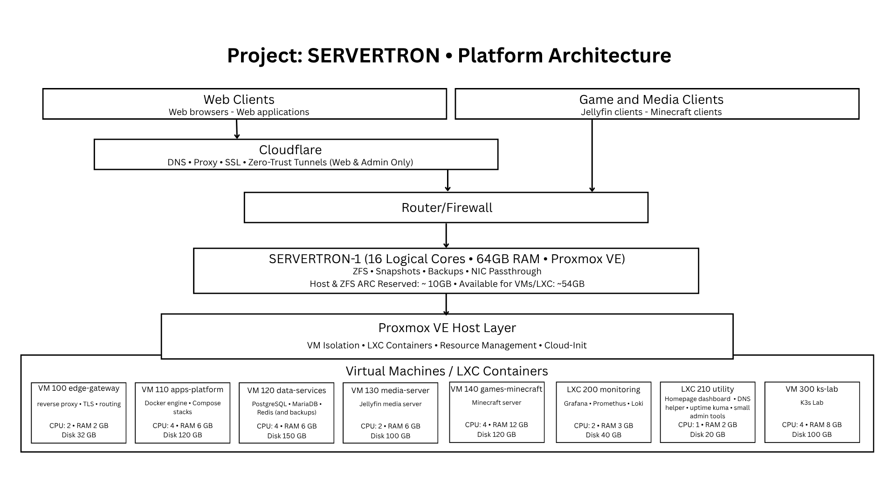

# Project: SERVERTRON Initial Architecture Notes

Initial notes on architecture during the planning phase of the first iteration of Project: SERVERTRON.  

*Project: SERVERTRON Architecture Diagram*

## Internet/Users

The Internet and users of the web server, media server, game server, and other Internet-facing apps.  

## Cloudflare

## SERVERTRON-1

Project: SERVERTRON will be implemented on a single-node mini-PC system (SERVERTRON-1). Proxmox will be installed on bare metal to provide a type 1 hypervisor for running virtual machines (VMs) and Linux containers (LXCs).  

SERVERTRON-1 is an Intel NUC 13 Pro Arena Canyon mini-PC with 13th Gen Core 17-1360P (12 cores/16 threads and up to 5.0GHz), 64 GB DDR4 RAM, 2 TB NVMe drive, WiFi6E, BT5.3, 2 x  

ZFS will be used for the file system as it provides data integrity, snapshots, and production-like storage behaviour aligned with the goal of mirroring real-world DevOps systems.  

## Proxmov VE Host Layer
**CPU:** Leave at least 2 threads uncommitted for host.  
**RAM:** Reserve 8 GB for host before planning guests.  
**Storage:** 400 GB. 100 for Proxmox, packages, and logs. 100 for ISOs, templates, backups/snippets/misc. 200 GB for ZFS/snapshot/free-space for operations.  

### ZFS ARC
**RAM:** Allow 8 GB for ZFS ARC and cap later if necessary.  

## Virtual Machines / LXC Containers

A layer of virtual machines and Linux containers running on Proxmox. Each contains isolated workloads.  

### Production Lane

The production lane hosts stable, persisent services intended for operational use, including externally exposed services and internal supporting systems.  

#### VM 100 edge-gateway (Edge Gateway)

**vCPU:** 2  
**RAM:** 2 GB  
**Storage:** 32 GB  

This separates VM 110 and VM 300 from outside traffic so that incoming traffic can be handled at the source.  

- Reverse proxy
- TLS termination
- Entry point for external traffic

#### VM 110 apps-platform (Apps Platform)

Applications and services running in Docker containers on an Ubuntu Server VM.  

**vCPU:** 4  
**RAM:** 6 GB  
**Storage:** 200 GB  

- Runs Docker / Docker Compose
- Hosts application services (web, APIs, etc.)

#### VM 120 data-services (Data Services)

**vCPU:** 4  
**RAM:** 6 GB  
**Storage:** 400 GB  

- Databases
- Persistent data layer

#### VM 130 media-server (Media Server)

**vCPU:** 2  
**RAM:** 6 GB  
**Storage:** 100 GB  

- Media server platform (Jellyfin)
- Metadata management and indexing
- External media storage integration
- Media content stored on external drive

#### VM 140 games-minecraft (Minecraft Game Server)

**vCPU:** 4  
**RAM:** 12 GB  
**Storage:** 120 GB

- Dedicated Minecraft server
- Persisten game world and server data
- Multiplayer game hosting

#### LXC 200 monitoring (Monitoring)

**vCPU:** 2  
**RAM:** 3 GB  
**Storage:** 40 GB

- Prometheus
- Grafana

#### LXC 210 utility (Utility Services)

**vCPU:** 1  
**RAM:** 2 GB  
**Storage:** 20 GB  

- Supporting tools
- Internal helpers

### Lab Lane

#### VM 300 k3s-lab (Kubernetes Lab)

**vCPU:** 4  
**RAM:** 8 GB  
**Storage:** 100 GB

- Kubernetes (K3s)
- Development and experimentation environment only

### Total Resources Assigned

**vCPUs assigned:** 23  
**RAM assigned:** 61 GB  
**Storage assigned:** 1412 GB  
