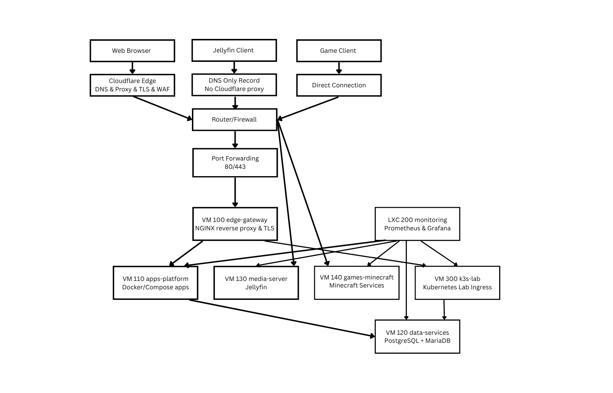

# Project: SERVERTRON Tooling Evaluation

## 1. Executive Summary

This document is an evaluation of core infrastructure tooling for Project: SERVERTRON. It exists to justify stack choices before the build phase.  

Proxmox was selected for the hypervisor. Ubuntu Server was selected as the operating system for guest VMs (with Debian-based LXCs). Docker will be used for containerisation in the production environment. Kubernetes will be used for container orchestration in the laboratory environment. Nginx will be used on the edge gateway as a reverse proxy.  

The rest of this document contains justification and supporting information for these decisions.  

## 2. Evaluation Criteria

Tools are evaluated according to the following criteria:  

- **Industry Relevance:** Tools used in real-world enterprise environments are used where possible.
- **Learning Value:** Education in new skills is a primary goal of Project: SERVERTRON and this affects tooling choices.
- **Operational Complexity:** In some tooling decisions, tradeoffs were made between realism and ease of use.  
- **Performance & Scalability:** Performance, functionality, and scalability must be considered for each choice of tooling.
- **Documentation Quality:** Quality of documentation enables better learning and troubleshooting of tools.
- **Community & Ecosystem:** Tools with large communities and diverse ecosystems should be favoured.
- **Compliance with Project Constraints:** The constraints of Project: SERVERTRON must be followed in all tooling choices.
- **Cost:** Costs of Project: SERVERTRON must be carefully managed. Free and open source tools are therefore preferred.
- **Resource Usage:** As a single-node system, resource usage must be considered in tooling choices.

## 3. Constraints & Assumptions

The following are the constraints and assumptions for Project: SERVERTRON:

- The host machine, SERVERTRON-1, is pre-existing infrastructure. Further expenditure on the project will be minimal unless necessary hardware fails.
- SERVERTRON-1 is limited by its specifications: 16 logical cores, 64 GB RAM, and a 2 TB NVMe for internal storage.
- Production workloads must be isolated from development, learning, and experimental environments.
- Internet-facing services (and internal ones) must be kept secure and available.
- Kubernetes will not be used in the production environment as it is designed for multi-node systems and adds unnecessary complexity to the project.

## 4. Tooling Categories Overview

The following domains were evaluated for tooling:

- Hypervisor
- Operating system(s)
- Containerisation
- Orchestration
- Reverse proxy / edge gateway
- Databases
- Monitoring and observability
- Networking
- CI/CD and GitOps (in a future iteration)

## 5. Hypervisor Evaluation

### Options Considered

- **VMware ESXi:** An industry-standard hypervisor with strong performance and features. Limited functionality on the free tier and less flexibility for container-based workloads.
- **Microsoft Hyper-V:** Integrates well with Windows environment, but less suitable for the Linux-based stack and tooling planned for Project: SERVERTRON.  
- **Bare-metal Linux (no hypervisor):** This is a simpler setup but lacks isolation, flexibility, and the ability to model multi-system architectures. It should be noted that SERVERTRON-1 was running bare-metal Linux previously to being rebuilt as a Proxmox hypervisor in Project: SERVERTRON.  

### Comparison Criteria

- Enterprise usage
- Cost
- Feature set
- Suitability for project

### Decision

Proxmox VE will be used as a hypervisor.  

### Rationale

- Balances enterprise concepts and ease of use
- Built-in clustering, storage, and networking
- Open-source and used frequently in homelabs and containerisation

## 6. Operating System Strategy

### Options Considered

- Ubuntu Server
- Rocky Linux
- AlmaLinux

### Evaluation

- Enterprise alignment
- Package ecosystem
- Learning curve
- Compatibility with Docker/Kubernetes

### Decision

Use Ubuntu Server as the standard guest operating system.  

### Rationale

Ubuntu Server offers an extensive ecosystem, community, and documentation. I am already familiar with Debian-based Linux, reducing the learning curve to master the system. Ubuntu Server is compatible with Docker and Kubernetes/K3s.  

Rocky Linux was considered to host the data layer for enterprise realism (as it is compatible with Red Hat Enterprise Linux). This was rejected in favour of using Ubuntu Server uniformly across all virtual machines, reducing unnecessary complexity and the learning curve for the system.  

## 7. Containerisation Strategy

### Options Considered

- Docker
- No containerisation

### Decision
Docker as the primary containerisation technology.  

### Rationale
Docker is industry standard in most environments and has simple integration for the early phases of the project. Docker is required knowledge for Kubernetes.  

## 8. Orchestration Strategy

### Options Considered
- Kubernetes
- K3s

### Decision
K3s, but in the lab environment only.  

### Rationale

Kubernetes orchestrates containers at scale, while Docker runs containers locally. K3s is a lightweight Kubrnetes distribution that allows me to learn real orchestration concepts in a resource-constrained environment. These skill may be transferred later to aid in building a more more distributed architecture (e.g. a cluster).  

## 9. Reverse Proxy / Edge Layer

### Options Considered

- NGINX
- Traefik
- **No edge gateway:** No edge gateway whatsoever would require multiple guest machines to be connected to the Internet and configured for security. This option was discarded as too complex, with too much redundant configuration.  

### Decision

NGINX will be used on VM 100 edge-gateway to serve as a reverse proxy and edge entry point for VM 110 apps-platform and VM 300 k3s-lab.  

### Rationale

NGINX was chosen because it is industry-standard tooling for reverse proxies. It provides full control over traffic routing, is compatible with both Docker and any future Kubernetes-based architecture, and has a good balance of performance, flexibility, documentation, and long-term compatibility with the rest of the technology stack.  

## 10. Database Strategy

### Options Considered

- PostgreSQL
- MariaDB
- MySQL

### Decision

PostgreSQL is selected as the primary database system. MariaDB will be used where required for compatibility (e.g. WordPress). Redis will be used for short-term memory.  

### Rationale

PostgreSQL is a widely used, production-ready relational database with strong reliability, data integrity, and extensibility. It aligns well with modern application architectures.  

## 11. Monitoring & Observability

### Options Considered
- Prometheus
- Loki
- Grafana

### Decision

Prometheus and Loki will be used for aggregation, and Grafana will be used for visualisation.  

### Rationale

Prometheus provides time-series metrics collection,Loki provides aggregation, and Grafana provides visualisation. Together they form a modern observability stack aligned with cloud-native and DevOps practices.  

## 12. Networking Approach

### Design Choices

- Reverse proxy as an entry point for apps-plaform and k3s-lab VMs (with TLS and WAF)
- Direction connection for game servers and Jellyfin
- Cloudflare handles DNS for all services and provides TLS termination, WAF, and DDoS protection for proxied web applications
- High bandwidth and non-HTTP services bypass the proxy and connect directly to their clients

*SERVERTRON Network Flow Diagram.*

### Future Considerations

- VLAN segmentation

## 13. Final Tooling Stack Summary

- Hypervisor: Proxmox VE
- Operating systems: Ubuntu Server
- Containers: Docker
- Orchestration: K3s (lab only)
- Reverse proxy: NGINX
- Database: PostgreSQL (primary), MariaDB (secondary), Redis (short-term)
- Monitoring: Prometheus, Loki, Grafana
- DNS & Edge: Cloudflare

## 14. Risks & Trade-Offs

- Single-node architecture introduces a single point of failure
- RAM allocation is high and may require tuning under load
- Kubernetes is not used in production, reducing realism for large-scale system
- Cloudflare proxy limitations require some services to be exposed directly
- Increased complexity compared to simpler homelab setups

## 15. Future Evolution

Options for future evolution include:

- Moving toward full Kubernetes
- Introducing high availability (clustering)
- Adding GitOps (ArgoCD)
- Adding NextCloud for cloud storage and other services

## 16. Appendix
